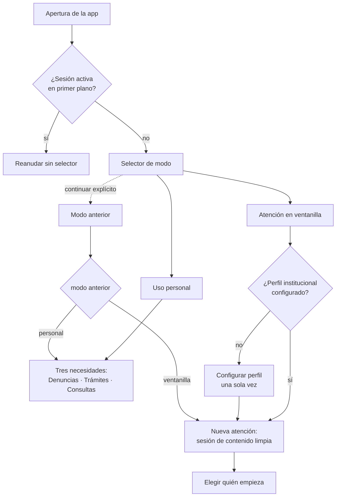
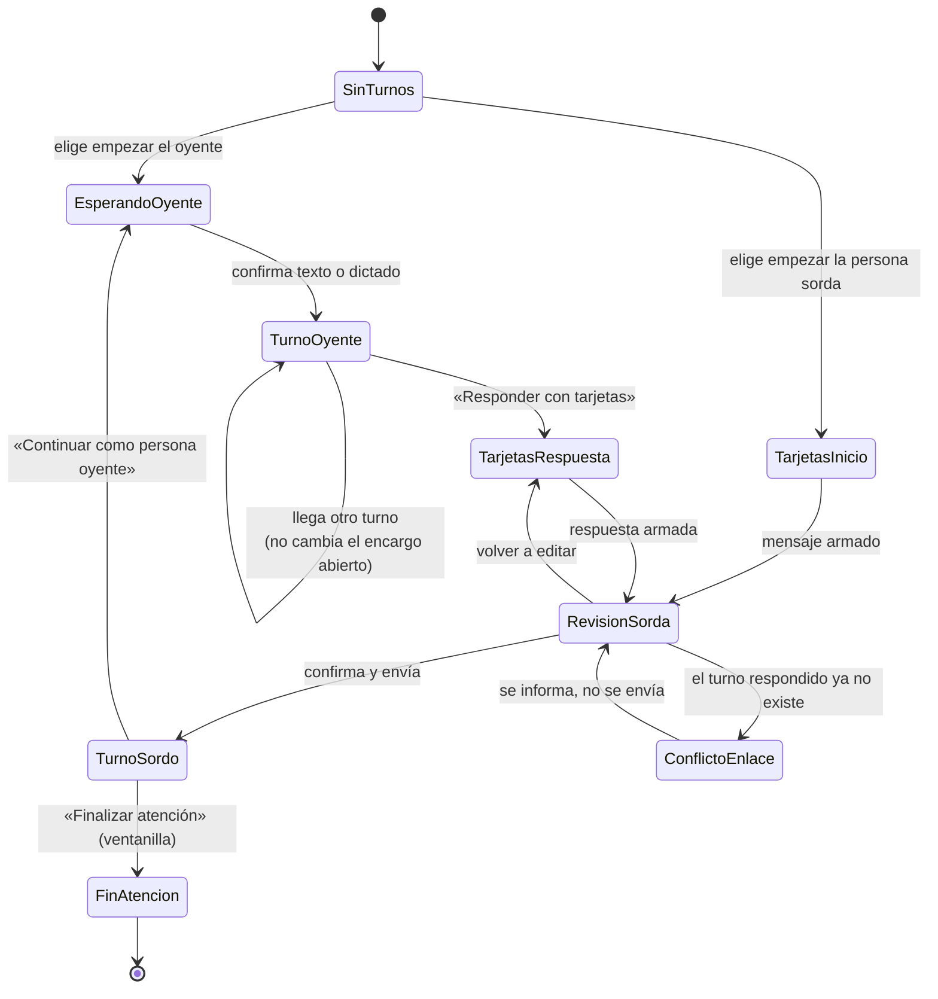

# Especificación de la lógica de negocio: modos de uso, necesidades e instituciones

Fase: organización de la lógica de negocio. **Nada de lo que describe este
documento está implementado.** No se ha reestructurado código de producción.
Lo que sí existe hoy son los tres propósitos de apertura del módulo de
tarjetas (A/B/C) y el grafo de diálogo, comprometidos en `68c6a4b`.

Referencia de revisión: árbol de trabajo en `68c6a4b`, posterior al ZIP
`OpenSoul-main (4)(1).zip`. Diferencias relevantes en §1.2.

---

## 1. Verificación previa

### 1.1. Cifras recalculadas contra el repositorio actual

Coinciden con las del encargo. Generadas por `tool/build_vocabulary_matrix.py`.

| Clase | Entradas |
|---|---:|
| Señas léxicas (corpus §12) | 303 |
| Letras dactilológicas | 27 |
| Dígitos | 10 |
| Instituciones con `canonicalGloss: d(...)` | 6 |
| **Total del catálogo** | **346** |

**El conteo léxico es 303.** Las otras 43 entradas son mecanismos de
representación y no deben sumarse al vocabulario de señas. La cifra de 210 no
corresponde a ningún estado actual del repositorio.

Verificado también: las 303 glosas del corpus §12 están **todas** en el
catálogo (0 ausencias), y las 6 institucionales llevan efectivamente
`canonicalGloss` en forma `d(...)`.

### 1.2. Diferencias respecto al ZIP de referencia

El árbol actual incorpora trabajo posterior al ZIP:

- `CardsFlowPurpose` / `CardsFlowLaunch` / `ConversationHandoff` ya existen, y
  `ReplyPrompt` ya transporta `turnId` y `conversationId`.
- `assets/dialogue/dialogue_graph.json` (209 nodos, 99 intenciones) ya existe.
- Los identificadores de turno ya no colisionan.

Esta especificación **respeta** esas correcciones y construye sobre ellas.

### 1.3. Corrección a una afirmación propia anterior

El documento `docs/Auditoria_Modos_ABC_2026-09.md` dice «animaciones realmente
horneadas en `avatar_test.glb`». Es una sobreafirmación: **no hay ningún
`.glb` en el repositorio**. Los 41 identificadores proceden de la constante
`available3DGlosses` de `animation_url_resolver.dart`. Lo correcto es decir
«identificadores que el resolutor declara disponibles». Nada de este trabajo
constituye una inspección del modelo 3D.

### 1.4. Hallazgo nuevo: los numerales del catálogo no coinciden con el resolutor

Según sus propias declaraciones en el código:

- `available3DGlosses` lista los numerales como palabras: `CERO`…`DIEZ`.
- El catálogo ofrece los numerales como dígitos: `'0'`…`'9'`.
- `AnimationUrlResolver.resolveAll` compara la glosa normalizada contra ese
  conjunto; `'0'` no está.
- Los dígitos tienen `animationFile: 'avatar_test.glb'` no vacío, así que
  **no** caen por la rama de marcador de posición: devuelven la URL real.
- `avatar_3d_viewer.dart:288` pide al visor `animationName = '0'`.

Bajo esos hechos declarados, se solicita al modelo una animación cuyo nombre
el propio resolutor no lista, y el paso depende del *watchdog* en vez de
terminar limpiamente — el mismo fallo que el código documenta para la I y la
K. `lambda_text_to_lsb.py:869` **sí** tiene el mapa dígito→palabra, de modo
que la ruta español → LSB no sufre el problema; la ruta de tarjetas, sí.

Esto **requiere confirmación en dispositivo**: sin el `.glb` no se puede
verificar estáticamente. Se registra como riesgo, no como defecto probado.

### 1.5. Correcciones pendientes confirmadas

Las cinco del informe técnico siguen abiertas. Verificadas una a una:

| # | Hallazgo | Evidencia |
|---|---|---|
| 1 | El generador puede convertir ESCAPAR en robo | `lambda_function.py:2226` — la rama `else: # robo` se activa siempre que `action != "PERDER"`, así que `ESCAPAR` solo produce «Denuncio el robo de mis pertenencias.» |
| 2 | `actorRole` frente a `actor_role` | `FactInfo.toJson()` emite `actorRole`; `lambda_function.py:2241` lee `escapar_actor` o `actor_role`. **La clave que envía el cliente nunca se lee.** |
| 3 | Campos estructurados ignorados según contexto | `lambda_function.py:2867` exige `context_type == "denuncia_robo"`. En `violencia`, `amenaza_digital` y `engano_dinero` el `declaration` se descarta en silencio. La función `uses_structured(body)` de la línea 1940 queda además ensombrecida por la variable local del mismo nombre: código muerto. |
| 4 | Validación insuficiente de protagonistas | `FactInfo.actorRole` es un `String?` libre; no hay tipo cerrado ni validación en el backend. |
| 5 | Pérdida del borrador al reabrir el mismo encargo | `ConversationHandoff.openCards` llama siempre a `clearSentence()` y `reset()`. `_confirmDiscardDraft` devuelve `true` sin preguntar cuando el encargo es el mismo (`sameErrand`), así que el borrador **se borra en silencio**. |

**El punto 5 es un defecto de código que introduje en `68c6a4b`.** No se
corrige en esta fase por instrucción explícita del encargo (no reestructurar
producción todavía); queda como primer elemento del plan de implementación.

### 1.6. Un único hecho por relato

`FactInfo.action` es un `String?` único
(`declaration_draft.dart:450`). ROBAR + ESCAPAR **no caben**: la segunda
selección sobrescribe la primera. El requisito de dos acciones exige cambiar
el modelo, no solo la interfaz.

---

## 2. Dimensiones del negocio

Siete dimensiones **independientes**. Ninguna se llama «contexto» y las
letras A/B/C se reservan para el propósito de apertura.

| # | Dimensión | Valores | Qué determina |
|---|---|---|---|
| D1 | Modo de uso | `personal`, `ventanilla` | Inicio, configuración, organización del trabajo y persistencia |
| D2 | Institución que atiende | perfil o `sin_institucion` | Prioridades iniciales del perfil de atención |
| D3 | Necesidad principal | `denuncias`, `tramites`, `consultas` | Qué quiere lograr la persona |
| D4 | Intención concreta | `RELATO_ABIERTO`, `CONSULTA_ESTADO`, … | Recorrido y datos necesarios |
| D5 | Propósito de las tarjetas | `independiente`, `inicio_conversacion`, `respuesta` | Relación con la conversación y `replyToId` |
| D6 | Acto comunicativo | declaración, pregunta, solicitud, respuesta, instrucción recibida | Cómo se interpreta y se redacta |
| D7 | Participante del turno | persona sorda, persona oyente | Quién expresa el contenido |

**R1.** El tamaño del dispositivo es condición de presentación, no dimensión
de negocio. `personal` y `ventanilla` funcionan en teléfono y en tablet.

**R2.** El modo (D1) no se deduce de la resolución, de una discapacidad
supuesta del propietario ni de quién habló primero. Se elige.

**R3.** Las siete dimensiones son internas. La entrada a la aplicación no
puede convertirse en siete formularios obligatorios: solo D1 se pregunta al
entrar, y D3 al empezar un mensaje en modo personal.

**R4.** D5 (propósito) y D6 (acto comunicativo) son **ortogonales**. El
propósito `independiente` admite un acto comunicativo `pregunta`. El nombre
actual `standaloneDeclaration` induce a error y debe renombrarse (§6.1).

**R5.** Institución que atiende (D2) ≠ institución mencionada. «Traje un
documento del juzgado» registra JUZGADO como mención; el perfil activo no
cambia.

---

## 3. Inicio y navegación

### 3.1. Selección al entrar

**R6.** Al entrar sin sesión activa se muestran dos opciones grandes:

- **Uso personal** — «Quiero comunicarme desde mi dispositivo».
- **Atención en ventanilla** — «Usaremos este dispositivo durante una atención».

**R7.** Se puede continuar explícitamente con el modo anterior, pero esa
continuación es una elección visible, no un salto automático.

**R8.** No se muestra ninguna conversación antes de decidir qué sesión
corresponde.

**R9.** Volver del segundo plano a una sesión **activa** no interrumpe con el
selector. La distinción es entre *nueva entrada* y *reanudación*.

**R10.** El modo activo queda visible y hay un control claro para cambiarlo.

**R11.** No se añaden cuentas, autenticación institucional, geolocalización ni
modo kiosco como requisito de esta organización.

### 3.2. Orden de la barra inferior

| Posición | Módulo | Identificador estable |
|---|---|---|
| Izquierda | Tarjetas LSB (LSB → texto/audio) | `cards` |
| Centro | Conversación | `conversation` |
| Derecha | Texto/voz a LSB | `avatar` |

**R12.** Conversación va al centro en ambos modos.

**R13.** El orden visual no obliga a abrir esa pestaña al entrar. En
`personal` el inicio lleva a las tres necesidades; en `ventanilla`, a preparar
una atención nueva.

**R14 (migración).** Hoy `SessionSnapshot.tabIndex` es un entero posicional
(`0` conversación, `1` tarjetas, `2` avatar) y `AppTab.index` alimenta un
`IndexedStack`. Reordenar el enum restauraría la pestaña equivocada. La
persistencia debe pasar a **identificadores estables** (`"conversation"`,
`"cards"`, `"avatar"`), con lectura tolerante de los enteros antiguos según la
tabla anterior, y un mapeo visual explícito separado del orden del enum.

---

## 4. Modo personal

**R15.** Se puede empezar sin pregunta del oyente y sin conocer la institución.

**R16.** El recorrido es: necesidad → qué desea comunicar → institución
(opcional, con «No sé / aún no elegí») → construcción guiada → revisión →
decisión (reproducir, mostrar o iniciar conversación).

**R17.** El punto de partida cambia con la necesidad, no solo el título:

| Necesidad | Parte de | Primeros datos |
|---|---|---|
| Denuncias | lo sucedido | hecho, protagonista, objeto |
| Trámites y documentos | la gestión o el documento | gestión, documento, institución |
| Consultas y asistencia | lo que necesita saber | qué pregunta, sobre qué |

**R18.** Se conserva volver, corregir, omitir un dato cuando proceda y
finalizar.

**R19.** Al pulsar «Iniciar conversación con este mensaje» se conserva el
contenido confirmado y su procedencia; la intervención pasa a ser inicio
propio con `replyToId = null`. No se reconstruye desde cero ni se envía dos
veces.

**R20.** Si después el oyente habla o escribe, la persona sorda abre una
respuesta a ese turno, con su texto original y las opciones correspondientes.

---

## 5. Modo ventanilla

**R21.** El perfil institucional se configura una vez y persiste entre
atenciones. Contiene nombre, tipo de servicio y prioridades. **No contiene
datos del ciudadano anterior.**

**R22.** Al iniciar una atención se crea una sesión limpia con el perfil
disponible, y se ofrece empezar por texto/voz del oyente **o** por tarjetas de
la persona sorda. Ninguno está obligado a hablar primero.

**R23.** Si empieza el oyente: se conserva la transcripción original íntegra y
se obtiene su sentido y acto comunicativo. «Responder con tarjetas» abre una
respuesta dirigida a ese turno.

**R24.** Si empieza la persona sorda: se abre una intervención propia adaptada
a los servicios del perfil, **sin pregunta ficticia del funcionario**.

**R25.** Tras revisar y enviar, «Continuar como persona oyente» devuelve el
control al campo de entrada. El ciclo se repite.

**R26.** El banco de preguntas del funcionario es una superficie **distinta**
de las tarjetas con que la persona sorda expresa su mensaje. Una elección del
funcionario nunca pone una declaración de conformidad en boca de ella.

**R27.** El perfil no sustituye al mensaje real. En DDRR, «¿Cuál es su
nombre?» es identificación. Debe poder cambiarse de necesidad dentro de la
atención: las prioridades institucionales son orden, no prohibición.

**R28 (fin de atención).** «Finalizar atención» borra mensajes, borradores,
aclaraciones y resultados reproducibles de esa atención, y conserva la
configuración institucional. Cualquier conservación deliberada de historial se
define aparte y por separado.

**R29.** No se hereda el historial personal del propietario del dispositivo ni
se muestran datos del ciudadano anterior. **La restauración automática de
conversación actual (`SessionRestorer.restore()` + clave única
`session_snapshot_v1`) es incompatible con este uso compartido** y debe
separarse en dos almacenes (§7.3).

---

## 6. Cruce de modo y propósito

**R30.** Los seis cruces, con el comportamiento del módulo LSB → texto/audio:

| Modo | Propósito | Comportamiento |
|---|---|---|
| personal | independiente | Parte de necesidad e intención; institución opcional; no depende de turno oyente |
| personal | inicio en conversación | Intervención propia; conserva el mensaje preparado si existe; `replyToId` nulo |
| personal | respuesta | Texto original, sentido confirmado e identidad del turno oyente |
| ventanilla | independiente | Mensaje propio con ayuda del perfil; no inventa pregunta previa |
| ventanilla | inicio en conversación | La persona sorda abre la atención; el perfil ayuda, no es contenido declarado |
| ventanilla | respuesta | Turno concreto + perfil de la atención para organizar opciones |

**R31.** Los dos modos comparten motor semántico e identificadores de glosas.
Se diferencian en presentación y recorridos. **Prohibido** duplicar
diccionarios o tener dos generadores que den sentidos distintos a la misma
selección.

**R32.** Encabezados, prioridades y subpreguntas pueden adaptarse al modo. La
acción, el protagonista, la negación y la intención confirmadas **no**.
«Ventanilla» no autoriza a convertir toda frase en acta ni en tercera persona.

### 6.1. Adaptación necesaria del enum de propósito

`CardsFlowPurpose.standaloneDeclaration` fuerza semánticamente una afirmación,
pero R4 exige que una intervención independiente admita una pregunta propia.

**Propuesta:** renombrar a `standaloneIntervention`, y que el acto
comunicativo viaje aparte en el lanzamiento (`intendedSpeechAct`). Los otros
dos valores no cambian de significado.

**Compatibilidad:** el propósito no se persiste hoy —`SessionSnapshot` no lo
guarda— así que el renombrado no rompe sesiones almacenadas. Si en el futuro
se persiste, debe leerse `standaloneDeclaration` como alias de entrada.

---

## 7. Contratos y persistencia: resumen

Detalle completo en `04_Contratos_Datos.md`.

**R33.** Identificadores tipados y validados en cliente **y** backend. La
configuración de interfaz no sustituye la validación del backend.

**R34.** Un hecho deja de ser `FactInfo.action` único y pasa a ser una
colección de hechos, cada uno con protagonista, objeto, negación y detalles.

**R35 (persistencia separada).** Dos almacenes distintos:

| Almacén | Clave | Contenido | Se borra al finalizar atención |
|---|---|---|---|
| Configuración | `device_config_v1` | modo de uso, perfil institucional, pestaña | No |
| Contenido | `session_content_v1` | conversación, borradores, aclaraciones, resultados | Sí |

---

## 8. Diagramas

### 8.1. Entrada y selección de modo

### 8.2. Estados de conversación y paso a tarjetas

---

## 9. Qué queda resuelto y qué no

### Resuelto por esta especificación

- D1…D7 separadas, con las letras A/B/C reservadas a D5.
- Orden de la barra inferior e identificadores estables para la migración.
- Los seis cruces de modo × propósito.
- Separación de configuración y contenido en dos almacenes.
- Renombrado de `standaloneDeclaration` y su compatibilidad.
- 11 perfiles institucionales con cobertura real calculada.
- Clasificación de las 346 entradas del catálogo.

### Limitaciones concretas, sin adorno

1. El corpus es de **etapa preliminar judicial**. Los perfiles registral,
   notarial y municipal amplían el alcance **sin corpus que los respalde**:
   5 de las 41 intenciones propuestas no tienen ninguna cobertura léxica.
2. 14 conceptos necesarios están ausentes del catálogo (§ matriz de
   vocabulario). Ninguno se incorpora como seña nueva.
3. Ninguna composición de este documento está validada con señantes de
   Cochabamba ni con intérpretes.
4. Las denominaciones marcadas `por_verificar` en
   `config/perfiles_institucionales.json` deben contrastarse con fuente
   oficial antes de mostrarse.
5. No se ha ejecutado ninguna prueba de interfaz de los modos nuevos, porque
   no existen. Lo único ejecutado en esta fase son los validadores de datos.

### Afirmaciones que NO se hacen

No se afirma 60 FPS, comprensión garantizada, eliminación de la figura del
intérprete, reducción de 30–45 minutos, actas exactas ni consentimiento
informado. Generar un texto no demuestra que un acta posterior coincida con él
ni que la persona haya consentido su contenido. **No se añadirá ningún botón
que declare conformidad automáticamente.** El sistema es un apoyo
comunicativo.

Tampoco se impone una fórmula OSV como garantía de corrección de toda frase en
LSB, ni se sustituye «buenas tardes» por «buenos días» porque la segunda tenga
tarjeta.
