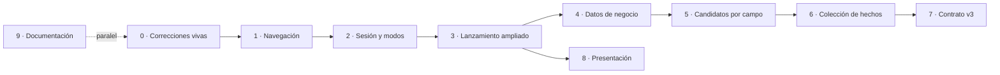

# Plan de implementación por archivos y dependencias

Orden propuesto para la fase siguiente. Cada bloque depende del anterior. Los
archivos citados existen hoy; los marcados **nuevo** no.

Ninguno de estos cambios está hecho.

---

## Bloque 0 — Correcciones vivas (antes de cualquier función nueva)

Son defectos confirmados que empeoran al construir encima. Ninguno depende de
los modos nuevos.

| # | Archivo | Cambio | Evidencia |
|---|---|---|---|
| 0.1 | `lib/features/conversation/presentation/providers/conversation_handoff.dart` | `openCards` no debe limpiar la frase ni reiniciar zonas cuando `launch.sameErrand(actual)`. Hoy borra el borrador en silencio al reabrir el mismo encargo. | §1.5-5 de la especificación |
| 0.2 | `aws/lambda_function.py:2226` | La rama de robo no puede activarse por descarte. Debe exigir una acción de robo explícita; `ESCAPAR` sola no redacta un robo. | §1.5-1 |
| 0.3 | `aws/lambda_function.py:2241` | Leer `actorRole` además de `actor_role` y `escapar_actor`; registrar el uso de las formas antiguas. | §1.5-2 |
| 0.4 | `aws/lambda_function.py:2867` y `:1940` | Quitar la puerta `context_type == "denuncia_robo"`; eliminar la función `uses_structured` ensombrecida por la variable local. | §1.5-3 |
| 0.5 | `lib/core/domain/services/animation_url_resolver.dart` | Confirmar en dispositivo el desajuste dígito `'0'` ↔ animación `CERO`. Si se confirma, añadir el mapa dígito→palabra que ya existe en `lambda_text_to_lsb.py:869`. | §1.4 |

**Dependencia:** ninguna. **Prueba:** unitaria por cada punto; 0.5 necesita
comprobación en dispositivo, no test.

---

## Bloque 1 — Navegación e identificadores estables

| # | Archivo | Cambio |
|---|---|---|
| 1.1 | `lib/app/navigation_provider.dart` | `AppTab` → `AppTabId` con `id` de cadena; `kTabOrder` como lista visual separada del orden del enum. |
| 1.2 | `lib/app/screens/main_navigation_screen.dart` | `IndexedStack` indexado por `kTabOrder.indexOf(tab)`; barra inferior con Conversación al centro. |
| 1.3 | `lib/core/domain/entities/session_snapshot.dart` | `tabIndex` (int) → `lastTab` (String). |
| 1.4 | `lib/core/data/repositories/session_repository_impl.dart` | Migración desde `session_snapshot_v1`: `{0: conversation, 1: cards, 2: avatar}`. |
| 1.5 | `lib/core/presentation/session/flow_surface.dart` | Revisar si `FlowSurface` sigue aportando algo una vez que el propósito vive en el lanzamiento; probablemente se elimina. |

**Dependencia:** bloque 0. **Riesgo:** una sesión guardada con el orden
anterior debe abrir la pestaña correcta — caso AC-14.

---

## Bloque 2 — Sesión, modo de uso y persistencia separada

| # | Archivo | Cambio |
|---|---|---|
| 2.1 | `lib/core/domain/entities/device_config.dart` **nuevo** | `UsageMode`, `DeviceConfig`. |
| 2.2 | `lib/core/domain/entities/session_content.dart` **nuevo** | `SessionContent` con conversación, borrador y aclaraciones. |
| 2.3 | `lib/core/data/repositories/session_repository_impl.dart` | Dos claves: `device_config_v1` y `session_content_v1`. |
| 2.4 | `lib/app/session_restorer.dart` | Restaurar configuración siempre; restaurar contenido **solo** si el modo es `personal` o si la atención sigue abierta. |
| 2.5 | `lib/app/screens/mode_selection_screen.dart` **nuevo** | Selector de entrada (R6–R11). |
| 2.6 | `lib/features/counter/…` **nuevo** | Perfil institucional, inicio y «Finalizar atención» (R21–R29). |

**Dependencia:** bloque 1. **Riesgo mayor:** R29 — hoy la conversación se
restaura automáticamente desde una clave única. Es el caso AC-13.

---

## Bloque 3 — Necesidad, intención y perfil en el lanzamiento

| # | Archivo | Cambio |
|---|---|---|
| 3.1 | `lib/core/presentation/session/cards_flow_launch.dart` | Renombrar `standaloneDeclaration` → `standaloneIntervention`; añadir `intendedAct`, `need`, `intentId`, `institutionProfileId`. |
| 3.2 | `lib/features/conversation/presentation/providers/conversation_handoff.dart` | Construir el lanzamiento con la necesidad y el perfil activos. |
| 3.3 | `lib/features/lsb_to_text_audio/presentation/screens/home_screen.dart` | Encabezado según propósito **y** acto: una consulta independiente no se anuncia como declaración. |
| 3.4 | `lib/features/lsb_to_text_audio/presentation/screens/needs_screen.dart` **nuevo** | Las tres necesidades del modo personal (R16–R17). |

**Dependencia:** bloque 2.

---

## Bloque 4 — Datos de negocio en la aplicación

| # | Archivo | Cambio |
|---|---|---|
| 4.1 | `assets/business/institution_profiles.json` **nuevo** | Copia validada de `docs/negocio/config/perfiles_institucionales.json`, generada, no copiada a mano. |
| 4.2 | `tool/build_business_assets.py` **nuevo** | Genera 4.1 y falla si el validador falla. |
| 4.3 | `lib/core/data/datasources/institution_profile_datasource.dart` **nuevo** | Carga del asset, con grafo vacío como caída segura. |
| 4.4 | `pubspec.yaml` | Registrar `assets/business/`. |

**Dependencia:** bloque 3. **Fuente única:** los perfiles se editan en
`docs/negocio/config/`, nunca en `assets/`.

---

## Bloque 5 — Selección de candidatos por campo

El orden lógico que fija el encargo, hoy repartido entre varios providers.

| # | Archivo | Cambio |
|---|---|---|
| 5.1 | `lib/core/domain/services/candidate_engine.dart` **nuevo** | Los cinco pasos: propósito/acto/intención → campo y entidad → glosas compatibles → coherencia y polaridad → orden por relevancia. |
| 5.2 | `lib/features/lsb_to_text_audio/presentation/providers/cards_provider.dart` | Delegar en 5.1; el perfil y el modo son señales de orden, nunca filtros que eliminen una respuesta correcta. |
| 5.3 | `lib/core/domain/services/zone_inference_engine.dart` | Pasar de «zona» a «campo tipado»: el campo determina qué tipos de glosa admite. |
| 5.4 | `lib/core/domain/services/context_catalog.dart` | Eliminar las ramas muertas `'tramite'` y `'consulta'` de `resolveAssemblerContext`, o construir esos contextos de verdad. No dejarlas. |
| 5.5 | `lib/features/lsb_to_text_audio/presentation/widgets/card_grid.dart` | Cambiar de categoría o buscar no puede introducir una tarjeta incompatible con el campo activo. |

**Dependencia:** bloque 4. **Regla dura:** una opción no se vuelve válida
porque Bedrock la sugiera, ni se elimina por ser poco frecuente en esa
institución.

---

## Bloque 6 — Colección de hechos

| # | Archivo | Cambio |
|---|---|---|
| 6.1 | `lib/core/domain/entities/declaration_draft.dart` | `FactInfo` → `List<Fact>` con `id`, `ActorRole` tipado, `negated` y `certainty`. |
| 6.2 | `lib/features/lsb_to_text_audio/presentation/providers/denuncia_robo_draft_provider.dart` | Hasta dos acciones; editar o quitar una no toca la otra. |
| 6.3 | `lib/core/domain/services/local_sentence_assembler.dart` | Redactar dos hechos conservando protagonista y negación de cada uno. |
| 6.4 | `aws/lambda_function.py` | `generate_structured_sentence` sobre la colección; sin secuencia temporal inventada. |
| 6.5 | `lib/features/lsb_to_text_audio/presentation/widgets/entity_editor_sheets.dart` | Aclarar quién escapó; cancelar no registra un hecho incompleto. |

**Dependencia:** bloque 5. **Caso:** AC-11.

---

## Bloque 7 — Contrato de red v3

| # | Archivo | Cambio |
|---|---|---|
| 7.1 | `lib/core/data/datasources/remote_translation_datasource.dart` | `contractVersion: 3`; enviar modo, perfil, necesidad, intención y hechos. |
| 7.2 | `aws/lambda_function.py` | Validar los conjuntos cerrados (C17); aceptar v2 sin romperse. |
| 7.3 | `aws/lambda_text_to_lsb.py` | Recibir el perfil como señal de desambiguación, nunca como contenido. |
| 7.4 | `aws/tests/` | Pruebas de paridad cliente/backend para los campos nuevos. |

**Dependencia:** bloque 6.

---

## Bloque 8 — Presentación adaptable

| # | Archivo | Cambio |
|---|---|---|
| 8.1 | `lib/features/lsb_to_text_audio/presentation/widgets/card_grid.dart` | Cuadrícula por ancho disponible, no por modo de uso. |
| 8.2 | `lib/app/app_theme.dart` | Texto e icono distinguen las tres necesidades; el color no basta. |
| 8.3 | `lib/core/presentation/widgets/avatar_3d_viewer.dart` | Espacio suficiente en teléfono y tablet, en ambas orientaciones. |

**Dependencia:** bloque 3. **Regla:** `ventanilla` no se restringe a tablets
ni `personal` a teléfonos.

---

## Bloque 9 — Documentación académica

| # | Archivo | Cambio |
|---|---|---|
| 9.1 | `informe_final.md` §1.4 alcances, §1.5 límites | Registrar la ampliación a trámites registrales, notariales y municipales, y que incluir un perfil no demuestra cobertura. |
| 9.2 | `informe_final.md` §1.3 objetivos | Revisar si el objetivo general sigue diciendo «entornos judiciales» cuando el alcance se amplía. |
| 9.3 | `docs/Actualizacion_Documento_Grado_4.4_4.7.md` | Añadir la corrección de §1.3 de esta especificación sobre el `.glb`. |
| 9.4 | `docs/Auditoria_Modos_ABC_2026-09.md` | Corregir «horneadas en `avatar_test.glb`» por «declaradas por el resolutor». |

**Dependencia:** ninguna; puede hacerse en paralelo.

---

## Resumen de dependencias

